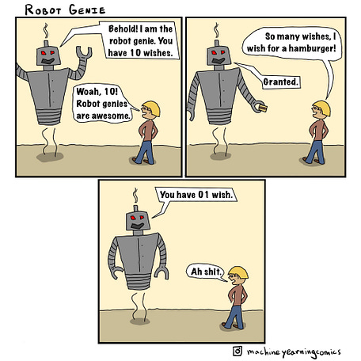

## Willkommen in LF2!
`Arbeitsplätze nach Kundenwunsch ausstatten`

[Quelle: Superintelligence Newsletter]{style="font-size: 1.2rem"}

## Willkommen in LF2!

`Arbeitsplätze nach Kundenwunsch ausstatten`

### Themenübersicht

:::  {style="font-size: 2rem"}

- Grundlagen moderner IT-Arbeitsplätze
- Anforderungsanalyse und Konzeption
- Hardware-, Software- und Lizenzmanagement
- Projektmanagement, Service & Qualitätssicherung
- Projektbewertung, Dokumentation, Nachfolgeprozesse

:::

## Zeitplan und Noten

- 80 Unterrichtseinheiten (UE) vom 14. September 2026 bis 4. März 2027
- **Klassenarbeit** am 17. November
- **Klassenarbeit** am 26. Februar

## Gemeinsame Notizen: Hedgedoc

In Hedgedoc können wir gemeinsame Notizen zum Unterricht erstellen:

<https://hedgedoc.c3d2.de/FI26_LF2>

## SuS Vorträge {style="font-size: 1.6rem"}

#### Vorgaben

- ca. 10 Minuten; mit Präsentation
- Teamarbeit zu zweit möglich: dann tragen beide je einen Teil vor

#### Themen

:::: columns
::: column

**Freitag, 18.09.2026 / Montag, 21.09:**   Hardware - Aufbau, Bewertungs-Kriterien

  + CPUs
  + Motherboards
  + RAM
  + Datenspeicher
  + Netzteile
  + Grafikkarten
  + Tablets
  + Drucker

:::

::: column

**Montag, 21.09.2026**

  + **Lastenheft:** Zweck, Urheber, Inhalt, kurze Beispiele für gelungene Lastenheft-Einträge
  + **Pflichtenheft:** Zweck, Urheber, Inhalt, kurze Beispiele für gelungene Pflichtenheft-Einträge

:::
:::: 

## Weitere Vortragsthemen

::: {style="font-size: 2rem"}

#### Dienstag, 22.09.2026

- Desktop-PCs: Thick Client / Thin Client / Zero Client  
  Leistungsmerkmale, Einsatzbereiche, Vor- und Nachteile
- Notebooks:
  + Vor- und Nachteile im Vergleich zu Desktop-PCs und Tablets
  + Leistungsmerkmale, Einsatzbereiche, typische Anschlüsse
- Tablets: 
  + Vor- und Nachteile im Vergleich zu Notebooks
  + Leistungsmerkmale, Einsatzbereiche, typische Anschlüsse

:::

## <!-- -->

{fig-align="center" width="50%"}

::: {style="text-align: center; font-size: 1rem;"}
[©torange.biz](https://torange.biz/cup-coffee-30851) CC-BY 4.0
:::

::: {style="color: green; text-align: center; font-size: 2.8rem"}
**Viel Erfolg!**
:::
