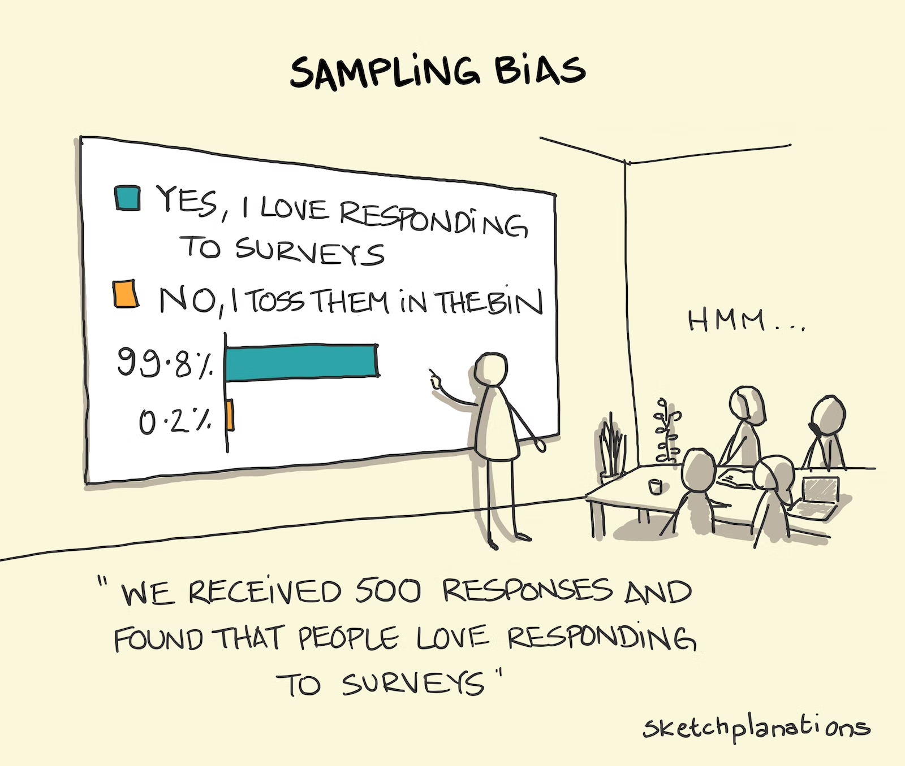

## Ist-Zustand erfassen

### Ziele

- Vorteile und Nachteile der Methoden verstehen:
  + Interview
  + Fragebogen
  + Beobachtung
- Entscheiden, welche Methode eingesetzt wird

## Interview

:::::: {style="font-size: 2rem"}

Direkte Befragung der Beteiligten zu einem oder mehreren Themenkomplexen.

::::: columns
:::: column

### Vorteile

::: incremental

- persönlicher Kontakt fördert Bereitschaft zur Auskunft
- Unklarheiten können sofort geklärt werden

:::
::::

:::: column

### Nachteile

::: incremental

- hoher Zeitaufwand
- Antworten oft subjektiv geprägt
- Fakten schwerer zu erfassen

:::
::::
:::::
::::::

## Fragebogen

:::::: {style="font-size: 1.8rem"}

- Kann geschlossene oder offene Fragen enthalten
- Geschlossen: Single Choice (Radiobuttons) oder Multiple Choice (Checkboxes)

::::: columns
:::: column

### Vorteile

::: incremental

- mehr Personen befragbar als beim Interview
- geringerer Zeitaufwand
- keine zusätzliche Dokumentation der Antworten
- automatische Auswertung möglich

:::
::::

:::: column

### Nachteile

::: incremental

- höherer Vorbereitungsaufwand
- oft geringer Rücklauf
- Verzerrungen bei Nicht-Teilnahme möglich!
- Unklarheiten schwerer zu klären

:::
::::
:::::
::::::

## Fragebogen

## Beobachtung

:::::: {style="font-size: 1.8rem"}

Prozesse werden vor Ort direkt begleitet und analysiert.

::::: columns
:::: column

### Vorteile

::: incremental

- Prozesse weitgehend objektiv beobachtbar
- effektive Erfassung möglich
- für zeitliche und quantitative Informationen über den Prozess geeignet

:::
::::

:::: column

### Nachteile

::: incremental

- hoher Zeitaufwand
- manchmal können nur **kleine Ausschnitte** eines Prozesses beobachtet werden
- Beobachtungen werden meist als unangenehm empfunden

:::
::::
:::::
::::::

## Auwahl einer Methode

:::: {style="font-size: 1.9rem"}

Aufgabe: Entscheiden Sie sich jeweils für eine Methode der Informationserfassung. Begründen Sie Ihre Entscheidung.  
Interview? Fragebogen? Beobachtung?

::: incremental

1. Verbesserung des Webauftritts eines Unternehmens
2. Erstellung eines Softwaremoduls für Einkauf, Lagerung und Verkauf von Waren.
3. Entwicklung einer Softwaresimulation für ein Ampelkreuzungssystem.

:::
::::

## Webauftritt verbessern

### Vorschlag: Fragebogen

::: {.incremental style="font-size: 2rem"}

- Es geht darum, die Bedürfnisse und Präferenzen der Nutzer zu verstehen
- Fragebogen gut geeignet, um Feedback von größerer Personengruppe zu erhalten: verschiedene Nutzergruppen
- Fragen z. B. zu Benutzerfreundlichkeit, gewünschte Funktionen, Design

:::

## Softwaremodul für Waren

### Vorschlag: Interview

::: {.incremental style="font-size: 2rem"}

- Softwaremodul für Geschäftsprozesse: erfordert detaillierte Erfassung der Anforderungen von Personen, die direkt mit den Prozessen arbeiten
- Interviews mit Einkaufs-, Lager- und Verkaufspersonal: präzise Erfassung der Abläufe, Anforderungen an die Datenverarbeitung, erforderliche Funktionen
- ermöglicht genaue Ausrichtung des Softwaremoduls auf die tatsächlichen Geschäftsbedürfnisse

:::

## Softwaresimulation für Ampelkreuzungssystem

### Vorschlag: Beobachtung

::: {.incremental style="font-size: 2rem"}

- hier wichtig: reales Verhalten und Interaktionen im Verkehrsumfeld zu verstehen
- Beobachtung vor Ort: Informationen über Verkehrsfluss, Verhaltensmuster der Fahrer, Verkehrsprobleme
- So kann realistische, effektive Simulation entwickelt werden, die den tatsächlichen Bedingungen entspricht

:::

## <!-- -->

{fig-align="center" width="50%"}

::: {style="text-align: center; font-size: 1rem;"}
[©torange.biz](https://torange.biz/cup-coffee-30851) CC-BY 4.0
:::

::: {style="color: green; text-align: center; font-size: 2.8rem"}
**Viel Erfolg!**
:::
