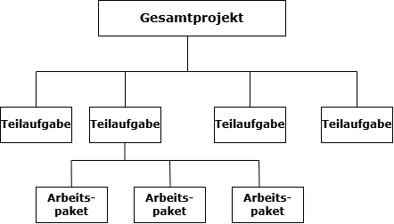
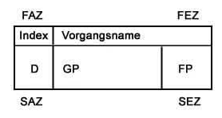

## Was ist ein Projekt? Merkmale

:::: {.incremental style="font-size: 1.9rem"}

- **Einmaligkeit:** Ein Projekt wird in der Regel nur einmal ausgeführt und ist kein Prozess, der sich regelmäßig wiederholt.
- **Klares Ziel:** In jedem Projekt wird ein bestimmtes Ergebnis oder Ziel verfolgt.
- **Zeitliche Befristung:** Projekte haben einen festgelegten Start- und Endzeitpunkt.
- **Interdisziplinär:** Eine Notwendigkeit ist oft die Zusammenarbeit mit verschiedenen Fachbereichen.
- **Risikobehaftet:** Projekte sind mit Unsicherheiten und Risiken verbunden.
- **Rahmenbedingungen:** Ein Projekt hat begrenzte Ressourcen, wie Geld, Personal, Zeit und hat klare Abgrenzungen zu anderen Projekten.

::::

::: notes
Lernkarte AP1 2025 Nr. 1
:::


## Projektstrukturplan

:::: columns
::: {.column .incremental style="font-size: 1.8rem"}

- Werkzeug zur Projektleitung
- engl. *Work Break Down Structure*
- deutsch auch Arbeitsstrukturplan
- enthält gesamten Leistungsumfang
- hierarchisch aufgebaut

:::

::: {.column .fragment}



::: {.incremental style="font-size: 1.7rem"}

- oberste Hierarchiestufe: Projekt als Ganzes
- zweite Ebene: Teilprojekte / Teilaufgaben
- dritte Ebene: Arbeitspakete (AP)

:::
:::
::::


## Gantt-Diagramm

```{mermaid}
%%{init: {'themeVariables': { 'fontSize': '18px' }}}%%
gantt
    title Einfaches Gantt-Diagramm
    dateFormat  YYYY-MM-DD
    axisFormat  %d.%m.

    section Planung
    Konzeptphase        :done,    des1, 2024-01-01, 2024-01-10
    Design              :active,  des2, 2024-01-11, 2024-01-20

    section Umsetzung
    Entwicklung         :crit,    dev1, 2024-01-21, 2024-02-15
    Tests               :         dev2, 2024-02-11, 2024-02-20

```

::: {.incremental style="font-size: 1.8rem"}
- Balkendiagramm zur Terminplanung
- stellt zeitliche Abfolge von Aktivitäten grafisch als Balken auf einer Zeitachse dar
- erste Spalte enthält Aktivitäten
- erste oder letzte Zeile stellt Zeitachse dar
- Aktivitäten können sich überschneiden (siehe Entwicklung und Tests)
:::


## Gantt-Diagramm: Mermaid

:::: {.columns style="font-size: 1.6rem"}
::: {.column .incremental width="45%"}

- Mermaid ("Meerjungfrau") ist eine vereinfachte Auszeichnungssprache und ein JavaScript-basiertes Open Source-Tool zur Diagrammerstellung
- inspiriert von Markdown
- kann mit einem Renderer komplexe Diagramme erstellen und verändern
:::

::: {.column .fragment}

```text
gantt
    title Einfaches Gantt-Diagramm
    dateFormat  YYYY-MM-DD
    axisFormat  %d.%m.

    section Planung
    Konzeptphase    :done,    des1, 2024-01-01, 2024-01-10
    Design          :active,  des2, 2024-01-11, 2024-01-20

    section Umsetzung
    Entwicklung     :crit,    dev1, 2024-01-21, 2024-02-15
    Tests           :         dev2, 2024-02-11, 2024-02-20

```

:::
::::

```{mermaid}
%%{init: {'themeVariables': { 'fontSize': '18px' }}}%%
gantt
    title Einfaches Gantt-Diagramm
    dateFormat  YYYY-MM-DD
    axisFormat  %d.%m.

    section Planung
    Konzeptphase       :done,   des1, 2024-01-01, 2024-01-10
    Design             :active, des2, 2024-01-11, 2024-01-20

    section Umsetzung
    Entwicklung        :crit,   dev1, 2024-01-21, 2024-02-15
    Tests              :        dev2, 2024-02-11, 2024-02-20

```


## Netzplan

:::: columns
::: {.column}



:::

::: {.column .fragment style="font-size: 1.6rem"}

- **FAZ** frühester Anfangszeitpunkt
- **FEZ** frühester Endzeitpunkt
- **SAZ** spätestens Anfangszeitpunkt
- **SEZ** spätester Endzeitpunkt
- **D** Dauer
- **GP** Gesamtpuffer
- **FP** freier Puffer
:::
::::

::: {.incremental style="font-size: 1.7rem"}

- hilft bei Terminplanung von Projekten
- stellt Dauer von Vorgängen im Gesamtprojekt grafisch dar
- Rechtecke für zeitliche Anordnung und logische Abhängigkeiten zwischen Vorgängen
- Verbindung der Vorgänge als Pfad mit Pfeilen
- Kritische Pfade und Pufferzeiten der einzelnen Vorgänge sowie Gesamtpufferzeiten sind jeweils gekennzeichnet

::: notes
Lernkarte AP1 2025 Nr. 3
:::

:::


## Netzplan: Aufbau eines Knotens

::: {style="font-size: 1.6rem"}

Abkürzung | Name | Erklärung | Berechnung
:---|------|:-----------|:--------
**FAZ** | Frühester Anfangszeitpunkt | Wann kann die Aufgabe **frühestens** starten? | Maximum der FEZ aller Vorgänger
**FEZ** | Frühester Endzeitpunkt | Wann ist die Aufgabe **frühestens** fertig? | FAZ + Dauer
**SAZ** | Spätester Anfangszeitpunkt | Wann **muss** die Aufgabe spätestens starten? | SEZ - Dauer
**SEZ** | Spätester Endzeitpunkt | Wann **muss** die Aufgabe spätestens fertig sein? | Minimum der SAZ aller Nachfolger
**GP** | Gesamtpuffer | Wie viel Verzögerung ist möglich, ohne das **Projektende** zu gefährden? | SAZ - FAZ oder SEZ - FEZ
**FP** | Freier Puffer | Wie viel Verzögerung ist möglich, ohne den **Nachfolger** zu gefährden? | FAZ(Nachfolger) - FEZ(Vorgang)
**D** | Dauer | Wie lange dauert die Aufgabe? | Vorgegeben

:::

::: notes
Quelle: https://it-lernapp.de/courses/7
:::


## Netzplan: Beispiel


:::: columns
::: {.column width="55%"}

[Quelle: <https://t2informatik.de/wissen-kompakt/netzplan/>]{style="font-size: 1.2rem"}

:::

::: {.column .fragment width="45%"}


:::
::::


## Netzplan: Kritischer Pfad

::: {.incremental style="font-size: 1.8rem"}

- Der **Kritische Pfad** (=kritischer Weg) ist der Weg von Anfang bis Ende aller Aktivitäten eines Netzplans, auf dem die Summe aller Pufferzeit (minimal oder) Null wird.
- Die Gesamtprojektdauer wird somit durch den kritischen Pfad bestimmt.
- DIN 69900:2009-01 Projektmanagement - Netzplantechnik
- Einzelne Aktivitäten innerhalb des Projekts können im Rahmen ihrer Pufferzeit zeitlich verschoben oder verlängert werden, ohne dabei die Gesamtprojektdauer zu gefährden.
- **Merke: Beim kritischen Pfad ist der Gesamtpuffer gleich Null.**

:::

::: notes
Lernkarte AP1 2025 Nr. 8

https://it-lernapp.de/courses/7

AP1 Frühjahr 2025 S. 8
Vorwärtsberechnung, Rückwärtsberechnung ist drin!
:::


## Netzplan: Kritischer Pfad

::: {.incremental style="font-size: 2.2rem"}

- Bestimmt die **Mindestprojektdauer**
- Alle Vorgänge auf dem kritischen Pfad haben GP = 0 (Gesamtpuffer = 0)
- Eine Verzögerung eines einzigen kritischen Vorgangs verzögert das **gesamte Projekt**
- Es gibt **mindestens einen** kritischen Pfad - manchmal auch mehrere

:::

::: notes
Quelle: https://it-lernapp.de/courses/7
:::


---

### Netzplan: Gesamtpuffer (GP) vs. Freier Puffer (FP)

[Unterscheidung ist Klassiker in der Prüfung!]{style="font-size: 2rem"}

::: {style="font-size: 1.6rem"}

Pufferart | Frage, die er beantwortet | Formel | Auswirkung bei Überschreitung
----------|---------------------------|--------|-------------------------------
**GP** | Wie lange kann ich verzögern, ohne das **Projektende** zu gefährden? | SAZ - FAZ | Projektende verschiebt sich
**FP** | Wie lange kann ich verzögern, ohne den **nächsten Vorgang** zu beeinflussen? | FAZ(Nachfolger) - FEZ | Nachfolger muss später starten

:::


## Netzplan berechnen

::: {style="font-size: 2rem"}

Gegeben sind nur die Vorgangsnummern und die Dauer.  
Aufgabe: FAZ, SAZ, FEZ, SEZ sowie GP und FP berechnen.

:::


## Netzplan: Vorwärtsrechnung - FAZ, FEZ

::: {.incremental style="font-size: 2rem"}

- Phase 1: **FAZ** und **FEZ** berechnen
- Vorgehen: **von links nach rechts**
- **Startknoten:** FAZ = 0, FEZ = 0 + Dauer
- **Jeder weitere Knoten:** FAZ = **Maximum** aller FEZ der Vorgänger
- FEZ = FAZ + Dauer
- Warum Maximum?
- Wenn Aufgabe zwei Vorgänger hat, kann sie erst starten, wenn **beide** fertig sind. -> Späteren Zeitpunkt auswählen

:::

## Netzplan: Rückwärtsrechnung - SAZ, SEZ

::: {.incremental style="font-size: 2rem"}

- Phase 2: **SAZ und SEZ** berechnen
- Vorgehen: **von rechts nach links**, zurück
- **Endknoten:** SEZ = FEZ, SAZ = SEZ - Dauer
- **Jeder weitere Knoten:** SEZ = Minimum aller SAZ der **Nachfolger**
- SAZ = SEZ - Dauer
- Warum Minimum?
- Wenn Aufgabe mehrere Nachfolger hat, muss sie so früh fertig sein, dass der **früheste** Nachfolger noch pünktlich starten kann.

:::


## Netzplan: Puffer berechnen

- Gesamtpuffer (GP) = SAZ - FAZ = SEZ - FEZ
- Freier Puffer (FP) = FAZ(Nachfolger) - FEZ(Vorgang)

::: incremental

- Achtung: FP ist immer <= GP!
- Der freie Puffer kann nie größer als der Gesamtpuffer sein.
- Vorgang auf dem kritischen Pfad: GP = FP = 0

:::

::: notes
Beispiel für Netzplan, Schritt für Schritt:
https://www.modu-learn.de/verstehen/management/netzplantechnik/
:::


## Netzplan: Prüfungstipps

:::: {style="font-size: 1.9rem"}

Vorgehen für Netzplan-Aufgaben in der IHK-Prüfung:

1. **Plan abzeichnen**, Dauern eintragen
2. **Vorwärtsrechnung:** FAZ und FEZ von links nach rechts - immer das **Maximum** der Vorgänger nehmen
3. **Rückwärtsrechnung:** SEZ und SAZ von rechts nach links - immer das **Minimum** der Nachfolger nehmen
4. **Puffer berechnen:** GP = SAZ - FAZ
5. **Kritischen Pfad markieren:** Alle Vorgänge mit GP = 0
6. **Kontrolle:** Projektdauer ist der FEZ des letzten Knotens

::::


## Netzplan: Typische Fallen

:::: {style="font-size: 2rem"}

::: incremental

- Vergessen, das **Maximum** bei mehreren Vorgängern zu nehmen (Vorwärtsrechnung)
- **GP und FP verwechseln:** GP bezieht sich auf Projektende, FP auf den Nachfolger
- Den kritischen Pfad nur am Anfang und Ende ablesen, statt **alle** Vorgänge mit GP = 0 zu prüfen

:::

Netzpläne üben: <https://it-lernapp.de/courses/7> (kostenloses Login erstellen)

::::

::: notes
Quelle: https://it-lernapp.de/courses/7
:::


## Projektmanagement: SMART

:::: {style="font-size: 1.8rem"}

**Beschreibe die fünf Punkte der SMART-Methode im Projektmanagement.**

::: incremental

- **S** ***Spezifisch:*** Die Projektziele sind so konkret wie möglich zu formulieren.
- **M** ***Messbar:*** Die Projektziele müssen messbar sein.
- **A** ***Aktivierend / Attraktiv:*** Die Projektziele müssen Motivation zur Umsetzung geben.
- **R** ***Realistisch:*** Die Projektziele müssen innerhalb des gesetzten Zeitrahmens umsetzbar sein.
- **T** ***Terminiert:*** Die Projektziele müssen zeitlich bindend sein. <br>Welche Aufgaben sind bis wann zu erledigen?

:::
::::

::: notes
Lernkarte AP1 2025 Nr. 226
:::


## <!-- -->

{fig-align="center" width="50%"}

::: {style="text-align: center; font-size: 1rem;"}
[©torange.biz](https://torange.biz/cup-coffee-30851) CC-BY 4.0
:::

::: {style="color: green; text-align: center; font-size: 2.8rem"}
**Viel Erfolg!**
:::
