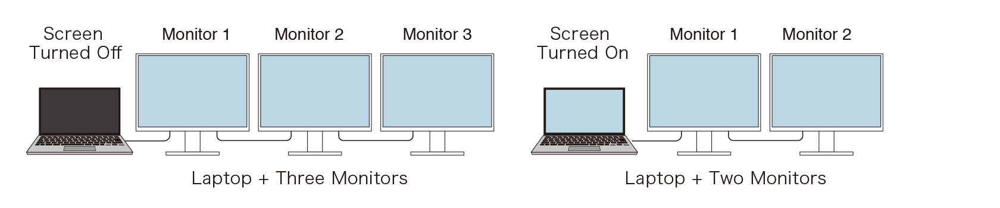

Gemeinsame Ausarbeitung: Bilder, Beschreibungen, Generationen / Versionen, ggf. Übertragungsraten etc.
Gliederung mit hierarchischen Überschriften ...

DDR3, DDR4, DDR5-RAM, SO-DIMM; DisplayPort (klassisch und mini); Thunderbolt; SATA (I, II, III); Speicherkarten (SD, microSD, evtl. mehr); DVI; VGA; USB (A, B, C)

Bildschirme: Wie funktioniert Daisy Chain? In welchen obigen Abschnitt gehört es?

*Gesucht: Bild in hoher Qualität von WLAN-Kabel*

www.amazon.de/uptitle-Kabel-Wi-Fi-Scherzartikel-Scherz/dp/B07WVK68SB

## Arbeitsspeicher

### Geschwindigkeitsvergleich

| Merkmal | DDR3 | DDR4 | DDR5 |
| -------- | -------- | -------- | -------- |
| Einführung | ca. 2007 | ca. 2014 | ca. 2020/21 |
| Geschwindigkeit | 800-2133 MT/s | 1600-3200 MT/s | 4800-8400+ MT/s |
| Kapazität | 8-16 GB | 32-64 GB | 16-128+ GB |
| Dual Channel | klassisch | klassisch | intern |
| ECC | nein | nein | ja |

- MT/s: MegaTransfer pro Sekunde
- Dual Channel
  - klassisch: RAM-Modul nutzt intern ein 64-Bit Channel
  - intern: RAM-Modul intern in zwei 32-Bit-Subchannels aufgeteilt
  - -> mit zweiten RAM-Modul kann die Bandbreite auf 128 Bit (2*64 Bit) erhöht werden

### ECC: Error Correcting Code

- Eine Art von Speicher welche eingebaute Reparaturfunktionen hat
- Erkennt und repariert selbst Multiple-Bit Fehler
- Durch die erhöhte Integrität der Daten werden jedoch andere Aspekte des Speichers verlangsamt (Zugriffs- / Schreibgeschwindigkeit)

## RAM Formfaktoren

### DIMM

- Dual Inline Memory Module 
- Verbaut in Full Size Desktops 
- Standart Form von RAM

### SO DIMM

- Small Outine Dual Inline Memory Module
- Verbaut in kleineres Gerät wie z.B. Laptops

### LP DIMM

- Low Power DIMM ist am
- verwendet in Kleinstgeräten wie Handys und Tablets
- generiert weniger Wärme und benötigt weniger RAM

### Anschlüsse

https://d1q3zw97enxzq2.cloudfront.net/images/Dram_slot_design_generation.width-1000.format-webp.webp

## DisplayPort

* Displayport überträgt Bild und Ton gleichzeitig
* DisplayPort wurde besonders für Computer und Monitore entwickelt, während HDMI sehr stark aus dem TV-/Unterhaltungsbereich kommt
* Mit MST (Multi-Stream Transport) können über einen DisplayPort-Anschluss teilweise mehrere Monitore betrieben werden, beispielweise über Daisy-Chaining oder eine Dockingstation
* DisplayPort unterstützt hohe Auflösungen und Bildwiederholraten, beispielsweise 144 Hz, 240 Hz oder mehr, sofern Grafikkarte, Monitor, Kabel und DP-Version mitspielen
* Adaptive Sync ist über DisplayPort möglich, etwa für variable Bildwiederholraten bei Gaming-Monitoren
* DisplayPort kann mit passenden Adaptern beispielweise auf HDMI, DVI oder VGA umgesetz werden. Dabei hängt es vom Adapter und Ausgang ab, ob ein passiver Adapter genügt
* Bei neueren DisplayPort-Versionen wird teilweise DSC (Display Stream Compression) eingesetzt. Damit können sehr hohe Auflösungen/Bildraten Übertragen werden, ohne dass die sichtbare Bildqualität normalerweise merklich leidet
* USB-C kann ebenfalls DisplayPort überteagen. Das nennt sich DisplayPort Alternate Mode. USB-C bedeutet allerdings nicht automatisch, dass das jeweilige Gerät DisplayPort unterstützt

### Versionen

* DP 1.2: bis 21,6 Gbit/s brutto
* DP 1.4: bis 32,4 Gbit/s brutto DSC-Unterstützung wichtig für höhere Auflösungen
* DP 2.x: deutlich höhere datenrate mit UHBR, je nach unterstützter Stufe

|  | DisplayPort klassisch | DisplayPort mini |
| -------- | -------- | -------- |
| Steckergröße     | größer, rechteckig mit  einer abgeschrägten Ecke     | deutlich kleiner     |
| Signal/Technik | DisplayPort | DisplayPort |
| Bild + Ton | Ja | ja |
| Typische Geräte | Pcs, Grafikkarten, Monitore  Dockingstations | ältere MacBooks, einige ältere Laptops/Monitore |
| Verriegelung | bei manchen Stecken mit Entriegelungstaste | normalerweise keine Verriegelung |
| Heute verbreitet? | Standard | stark rückläufig; verdrängt von USB-C / Thunderbolt |

## Thunderbolt

* **Thunderbolt** ist eine von **Intel** (zusammen mit Apple entwickelt) geschaffene **Hochgeschwindigkeits-Schnittstelle**
* Ermöglicht die **Datenübertragung**, **Videoausgabe** und **Stromversorgung** über ein einziges Kabel
* Nutzt den **USB-C-Anschluss** und kombiniert Technologien wie **PCI Express** und **DisplayPort**.
* Unterstützt je nach Version Datenraten von bis zu **80 Gbit/s**
* Hat **5 Versionen** - von Thunderbolt 1 bis Thunderbolt 5
* Ermöglicht den Anschluss mehrerer Geräte in einer **Daisy-Chain-Kette**, wodurch weniger Anschlüsse am Computer benötigt werde

## DVI

### Generationenvergleich

| Name | Art von Signal | max Auflösung |Übertragungsrate|
| -------- | -------- | -------- |--------|
| DVI-A| nur Analog  | 1920 x 1200 (60 Hz)|(nicht anwendbar, da nur analog) |
| DVI-D (Singlelink)   | nur Digital|  1920 x 1200 (60 Hz)      |3,96 Gbit/s |
| DVI-D (Duallink) | nur Digital|2560 x 1600 (60 Hz)          |7,92 Gbit/s |
|DVI-I (Singlelink)| wahlweise Analog oder Digital| 1920 x 1200 (60 Hz)| 3,96 Gbit/s|
| DVI-I (Duallink)| Analog und Digital|  2560 x 1600 (60 Hz)  |7,92 Gbit/s |

## USB

### Typ A 

USB Typ A, 2004; Quelle: Wikimedia Commons; Urheber: André Karwath aka Aka

### USB C

### Generationen-Vergleich

Name | möglich ab | max. Datenrate   in MB/s
-----|-----------|-----------------------------		
Low Speed | USB 1.0 | 0,15
Full Speed | USB 1.1 | 1
Hi-Speed | USB 2.0 | 40
SuperSpeed USB 5Gbps (SuperSpeed) | USB 3.2 Gen 1 | 400
SuperSpeed USB 10Gbps (SuperSpeed+) | USB 3.2 Gen 2 | 900	
SuperSpeed USB 20Gbps | USB 3.2 Gen 2x2 | 1.800

 
Name | USB-Standard | max. Datenrate in MB/s
-----|-------------|-----------------------
USB-C mit USB 2.0 | USB 2.0 | 60
USB-C mit USB 3.2 Gen 1 | USB 3.2 Gen 1 | 625
USB-C mit USB 3.2 Gen 2 | USB 3.2 Gen 2 | 1.250
USB-C mit USB 3.2 Gen 2x2 | USB 3.2 Gen 2x2 | 2.500
USB4 Gen 2x2 | USB4 | 2.500
USB4 Gen 3x2 | USB4 | 5.000
Thunderbolt 3 / 4 über USB-C | Thunderbolt | 5.000

### Infotext

USB-C ist ein moderner USB-Anschluss, der **beidseitig** eingesteckt werden kann. Er wird für die **Übertragung von Daten**, Strom sowie Bild- und Tonsignalen verwendet und ist heute bei vielen Smartphones, Tablets und Notebooks **Standard**. Die maximale Geschwindigkeit hängt vom verwendeten USB-Standard ab.

Von Karl und Moritz

## Bildschirme: Daisy Chain

Bildquelle: https://www.eizoglobal.com/support/compatibility/monitor/daisychain_guide/daisychain_example_en.jpg

- nutzt DisplayPort
- nur ein DisplayPort-Kabel am PC oder Notebook benötigt, um mehrere Monitore anzuschließen
- Verbindung der Monitore untereinander per Displayport 1.2 MST
- MST = *Multi Stream Support*
- Anzahl verwendbarer Monitore von der Auflösung abhängig. Je höher die Auflösung, desto weniger Monitore können angeschlossen werden.
- Leistung der Grafikkarte kann Flaschenhals sein.

## VGA

VGA steht für Video Graphics Array und ist ein Anschlussstandard zur Übertragung von analogen Bildsignalen von einem Computer zu einem Monitor oder Beamer.

| Version  | Bezeichnung                   | Typische Auflösung | Einführung |
| -------- | ----------------------------- | -----------------: | ---------: |
| **VGA**  | Video Graphics Array          |          640 × 480 |       1987 |
| **SVGA** | Super Video Graphics Array    |          800 × 600 |       1989 |
| **XGA**  | Extended Graphics Array       |         1024 × 768 |       1990 |
| **SXGA** | Super Extended Graphics Array |        1280 × 1024 |     1990er |
| **UXGA** | Ultra Extended Graphics Array |        1600 × 1200 |     1990er |

### Übertragungsrate

Bei VGA gibt es keine feste Übertragungsrate wie bei USB oder Ethernet, da VGA ein analoger Videosignalstandard ist.

Die benötigte Bandbreite hängt unter anderem ab von:

* Auflösung
* Bildwiederholrate
* Farbtiefe

### Verwendung heute

VGA wird heute nur noch selten verwendet. Es wurde weitgehend durch DVI, HDMI und DisplayPort ersetzt.

VGA findet man hauptsächlich noch bei:

* älteren Computern
* älteren Monitoren
* älteren Beamern

